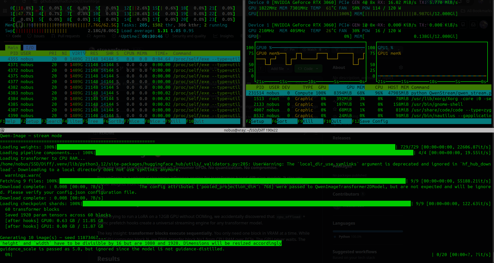

# StreamForge 🔥

**Run any large transformer model on consumer GPUs. No quantization. No compromise.**

StreamForge is a universal streaming inference engine for transformer-based diffusion models.
It streams model weights from CPU RAM to GPU one block at a time, keeping VRAM usage at 2-4GB
regardless of model size.

## The Discovery

While trying to run a LoRA on a 12GB GPU without OOMing, we accidentally discovered that
`cpu_offload` + async prefetch hooks create a universal streaming engine for any transformer model.

The key insight: **transformer blocks execute sequentially**. You only need one block in VRAM at a time.
While the GPU computes block N, we DMA-transfer block N+1 from CPU RAM over PCIe.
The GPU never waits. The model never knows it's streaming.

## Gallery

**Qwen-Image — default prompt, clean install, fresh env, RTX 3060**


**Qwen-Image — 1080p, 40GB model, <3GB VRAM, RTX 3060, full bfloat16**


*Prompt: "A fierce female police officer in full tactical riot gear standing in front of explosions, cinematic, 4K, photorealistic, dramatic lighting"*

**Batch of 10 × 1080p — 8394MiB (8.2GB) VRAM peak, GPU at 100% compute**



*GPU0: 8.2GB VRAM, 10 images × 1920×1072, 40GB model — on a single RTX 3060 12GB*

---

## Results

| Model | Size | Normal VRAM | StreamForge VRAM | Hardware |
|-------|------|-------------|------------------|----------|
| Z-Image-Turbo | ~11GB | 24GB (HF official) | **1.4GB** | RTX 3060 12GB |
| Wan2.2 I2V 14B | ~57GB | 80GB (HF official) | **2-4GB** | 2× RTX 3060 12GB |
| Qwen-Image | ~41GB | 40GB+ (HF official, text encoder offloaded) | **<3GB** (1 image) / **8GB** (batch of 10 @ 1080p) | RTX 3060 12GB |
| FLUX.1-dev | ~24GB | 24GB (HF official) | **<4GB** | RTX 3060 12GB |

**~$1200 USD hardware running models that normally require $30,000+ servers.**

## How It Works

```
CPU RAM (64GB)          PCIe Gen4           GPU (12GB VRAM)
┌─────────────┐         (~32 GB/s)         ┌──────────────┐
│ Block 0     │ ──── transfer N+1 ────>    │  Block N     │
│ Block 1     │                            │  computing   │
│ Block 2     │ <─── evict done ──────     │  at full     │
│ ...         │                            │  speed       │
│ Block 59    │                            └──────────────┘
└─────────────┘
```

Transfer happens async while GPU computes. PCIe (~32 GB/s) feeds the GPU fast enough
that it never stalls — because each block takes 30-50ms to compute but only ~6ms to transfer.

## Quick Start

```python
from engines.layer_prefetcher import setup_stream_mode
from diffusers import FluxPipeline, AutoModel
import torch

MODEL_ID = "black-forest-labs/FLUX.1-dev"
DEVICE   = torch.device("cuda:0")

# Load pipeline shell (no transformer)
pipe = FluxPipeline.from_pretrained(MODEL_ID, transformer=None, torch_dtype=torch.bfloat16)

# Load transformer to CPU RAM
transformer = AutoModel.from_pretrained(MODEL_ID, subfolder="transformer",
                                         device_map={"": "cpu"}, torch_dtype=torch.bfloat16)

# One call — auto-detects blocks, installs hooks, enables streaming
prefetcher = setup_stream_mode(transformer, DEVICE)
pipe.transformer = transformer

# Generate normally — streaming is transparent
result = pipe(prompt="a unicorn in an enchanted forest", width=768, height=768)
result.images[0].save("output.png")

prefetcher.remove()
```

## Supported Models

Any transformer-based diffusion model with `self.blocks`, `self.layers`, or `self.transformer_blocks`:

- ✅ **Z-Image / Z-Image-Turbo** (Tongyi-MAI) — **the original discovery**, 30 blocks, 1.4GB VRAM
- ✅ **Wan2.2 I2V 14B** (Wan-AI) — image-to-video, dual transformer, 2-4GB VRAM
- ✅ **Qwen-Image** (Qwen) — image generation, text rendering, 2-4GB VRAM
- ✅ **FLUX.1-dev** (Black Forest Labs) — image generation, 24GB → **<4GB VRAM**, 2m35s @ 1024×1024
- 🔜 **SD3** — image generation  
- 🔜 **CogVideoX** — video generation
- 🔜 **HunyuanVideo** — video generation
- 🔜 **Llama 70B** — language model

## Hardware Requirements

> **Minimum to run any model:** 4GB VRAM GPU + 32GB CPU RAM + PCIe Gen3  
> **Tested on:** RTX 3060 12GB × 2, AMD Ryzen 9 9900X, 64GB DDR5

| Component | Minimum | Recommended |
|-----------|---------|-------------|
| GPU VRAM | 4GB | 12GB+ |
| CPU RAM | 32GB | 128GB |
| RAM Speed | DDR4 | DDR5 6000+ |
| PCIe | Gen3 x8 | Gen4 x16 |
| CPU | Any | AMD Ryzen (fast memory controller) |

**VRAM is almost irrelevant** — StreamForge keeps peak VRAM at 2-4GB regardless of model size.  
**CPU RAM is the bottleneck** — the entire model must fit in RAM (e.g., 57GB for Wan2.2 14B needs 64GB+ RAM).

## Platform Support

| Platform | Status | Notes |
|----------|--------|-------|
| **Linux** | ✅ Confirmed | Native PCIe DMA, full async transfer, tested on Ubuntu |
| **Windows** | ⚠️ Untested | Should work but WSL2 has virtual PCIe — slower, less predictable |
| **macOS** | ❌ Not supported | No CUDA, MPS backend incompatible with `cpu_offload` |

StreamForge relies on CUDA + `accelerate.cpu_offload` for async PCIe streaming. Linux gives the best PCIe DMA performance — Windows native (not WSL2) may work but is untested.

## Architecture

```
StreamForge/
  engines/
    layer_prefetcher.py   # Universal streaming engine
  models/
    qwen_stream.py        # Qwen-Image example
    wan_stream.py         # Wan2.2 I2V example
  examples/
    basic_usage.py
  README.md
```

## Why It Works

- **Compute >> Transfer**: Each transformer block takes 30-50ms to compute on a 3060,
  but only ~6ms to transfer over PCIe Gen4. Transfer is fully hidden behind compute.
- **Sequential execution**: Transformers process blocks one at a time by design.
  StreamForge exploits this fundamental property.
- **No quantization**: Full bfloat16 precision. Quality identical to native GPU inference.
- **AMD advantage**: Fast memory controller + DDR5 = minimal transfer latency.

## Performance

Unoptimized (current):
- ~2-3× slower than native full-VRAM inference
- No pinned memory (avoids OOM on 64GB systems)

Planned optimizations:
- Pinned memory with 128GB+ RAM → faster PCIe DMA
- Prefetch N+2 instead of N+1 → deeper pipeline
- Dual GPU block splitting → parallel streams
- Block grouping → fewer transfers

Estimated optimized: **~80% of native GPU speed**

## The Math

```
Model: 14B params × 2 bytes (bfloat16) = 28GB
Blocks: 40 blocks × ~700MB each
Transfer per block: ~700MB / 32 GB/s = ~22ms
Compute per block: ~150ms on RTX 3060

Overlap ratio: 150ms compute / 22ms transfer = 6.8x
→ Transfer fully hidden, GPU never waits
```

## Credits

Discovered accidentally while trying to load a LoRA on a 12GB GPU.
Built with ❤️ on two RTX 3060 12GB cards, an AMD Ryzen 9 9900X, and 64GB DDR5.

**Proving that capability > hardware budget.**
